# 最小二乗法（Least Squares Method）

## 概要

最小二乗法は、データ点と近似曲線の誤差の二乗和を最小化することで、データに最もよく適合する関数を見つける手法です。統計学、機械学習、データ分析において最も基本的で重要なアルゴリズムの一つです。

このプログラムでは、1次式（線形回帰）と2次式（放物線回帰）による近似を実装しています。

## アルゴリズムの特徴

### 長所
- 解析的に解が求まる（反復計算不要）
- 実装がシンプル
- 多くの問題で良好な結果が得られる
- 統計的な解釈が明確
- 予測モデルとして広く使用されている

### 短所
- 外れ値の影響を受けやすい（誤差を二乗するため）
- 線形または低次の多項式にしか適用できない
- オーバーフィッティング（過学習）の可能性
- データが適切なモデルに従っている仮定が必要

## アルゴリズムの原理

### 基本的な考え方

データ点 `(x₁, y₁), (x₂, y₂), ..., (xₙ, yₙ)` に対して、近似関数 `f(x)` を求める。

目標: 誤差の二乗和を最小化

```
E = Σ(yᵢ - f(xᵢ))²
```

この `E` を最小にする関数 `f(x)` のパラメータを求める。

## アルゴリズムの流れ

```mermaid
flowchart TD
    Start([開始]) --> Input[データ点を入力<br/>&#40;x₁,y₁&#41;, &#40;x₂,y₂&#41;, ...]
    Input --> Choose{近似式の次数?}
    Choose -->|1次式| Linear[1次式近似<br/>y = ax + b]
    Choose -->|2次式| Quad[2次式近似<br/>y = ax² + bx + c]

    Linear --> CalcSum1[各種和を計算<br/>Σx, Σy, Σxy, Σx²]
    CalcSum1 --> Normal1[正規方程式を解く<br/>a, b を計算]
    Normal1 --> Result

    Quad --> CalcSum2[各種和を計算<br/>Σx, Σy, Σx², Σx³,<br/>Σx⁴, Σxy, Σx²y]
    CalcSum2 --> Normal2[連立方程式を解く<br/>&#40;クラメルの公式&#41;<br/>a, b, c を計算]
    Normal2 --> Result

    Result[近似式の決定] --> Predict[予測値を計算]
    Predict --> Evaluate[評価指標を計算<br/>&#40;誤差、R²&#41;]
    Evaluate --> Output[結果を出力]
    Output --> End([終了])
```



## 詳細な処理フロー

### 1. 線形回帰（1次式近似）

目標: `y = ax + b` の形で近似

#### 正規方程式

```
a = (n·Σxy - Σx·Σy) / (n·Σx² - (Σx)²)
b = (Σy - a·Σx) / n
```

ここで:
- `n`: データ点の数
- `Σx`: x座標の総和
- `Σy`: y座標の総和
- `Σxy`: x·y の総和
- `Σx²`: x² の総和

#### 計算手順

1. データ点から各種和を計算
2. 正規方程式に代入して `a` を計算
3. `a` を使って `b` を計算
4. 近似式 `y = ax + b` が完成

### 2. 二次回帰（2次式近似）

目標: `y = ax² + bx + c` の形で近似

#### 正規方程式（連立方程式）

```
Σy   = a·Σx² + b·Σx  + c·n
Σxy  = a·Σx³ + b·Σx² + c·Σx
Σx²y = a·Σx⁴ + b·Σx³ + c·Σx²
```

この3元連立方程式を行列形式で表現:

```
| Σx⁴  Σx³  Σx² | | a |   | Σx²y |
| Σx³  Σx²  Σx  | | b | = | Σxy  |
| Σx²  Σx   n   | | c |   | Σy   |
```

#### 計算手順

1. データ点から各種和を計算（Σx, Σy, Σx², Σx³, Σx⁴, Σxy, Σx²y）
2. クラメルの公式を使って連立方程式を解く
3. 係数 `a`, `b`, `c` を計算
4. 近似式 `y = ax² + bx + c` が完成

### 3. 評価指標

#### 決定係数（R²）

モデルの当てはまりの良さを表す指標（0 ～ 1の範囲）

```
R² = 1 - (Σ(誤差²) / Σ(yᵢ - ȳ)²)
```

- `R² = 1`: 完全にデータに適合
- `R² = 0`: 平均値と同程度の予測しかできない
- `R² < 0`: モデルが不適切

## 実行方法

```bash
cd least-squares
go run main.go
```

## 出力例

```
最小二乗法（Least Squares Method）のデモ
==========================================

=== 最小二乗法の原理 ===
データ点と近似曲線の「誤差の二乗和」を最小化する方法

  y |
    |    ●  <- データ点
    |   /|
    |  / | <- 誤差
    | /  |
    |/___●______ 近似直線
    |
    |  ●
    |____________________ x

誤差 = 実測値 - 予測値
目標: Σ(誤差²) を最小化

【例1】1次式近似 - 線形に近いデータ
真の関数: y = 2x + 3 (に近いデータ)

=== 1次式近似（線形回帰）開始 ===
目標: y = ax + b の形で近似
データ点数: 6

入力データ:
  点1: (x=1.00, y=5.10)
  点2: (x=2.00, y=7.00)
  点3: (x=3.00, y=8.90)
  点4: (x=4.00, y=11.10)
  点5: (x=5.00, y=12.80)
  点6: (x=6.00, y=15.20)

中間計算:
  n     = 6
  Σx    = 21.0000
  Σy    = 60.1000
  Σxy   = 227.1000
  Σx²   = 91.0000

=== 計算結果 ===
近似式: y = 1.9886x + 3.0476

予測値と誤差:
  点1: x=1.00, 実測値=5.10, 予測値=5.0362, 誤差=0.0638
  点2: x=2.00, 実測値=7.00, 予測値=7.0248, 誤差=-0.0248
  点3: x=3.00, 実測値=8.90, 予測値=9.0133, 誤差=-0.1133
  点4: x=4.00, 実測値=11.10, 予測値=11.0019, 誤差=0.0981
  点5: x=5.00, 実測値=12.80, 予測値=12.9905, 誤差=-0.1905
  点6: x=6.00, 実測値=15.20, 予測値=14.9790, 誤差=0.2210

二乗誤差の和: 0.121457
決定係数 R²: 0.998743
(R²が1に近いほど、データへの当てはまりが良い)

新しい値の予測:
  x=2.5 のとき、y=7.9190 と予測
  x=7.0 のとき、y=16.9676 と予測
```

## コードの主要な構造

### `DataPoint` 構造体
データ点 `(x, y)` を表す構造体

### `LinearRegression` 構造体
1次式近似（線形回帰）を実装

**フィールド:**
- `data []DataPoint`: データ点の配列
- `a float64`: 傾き
- `b float64`: 切片
- `fitted bool`: フィッティング済みフラグ

**メソッド:**
- `Fit()`: 最小二乗法でパラメータを計算
- `Predict(x)`: 与えられたxに対してy値を予測

### `QuadraticRegression` 構造体
2次式近似（放物線回帰）を実装

**フィールド:**
- `data []DataPoint`: データ点の配列
- `a float64`: x²の係数
- `b float64`: xの係数
- `c float64`: 定数項
- `fitted bool`: フィッティング済みフラグ

**メソッド:**
- `Fit()`: 最小二乗法でパラメータを計算（クラメルの公式）
- `Predict(x)`: 与えられたxに対してy値を予測

### `VisualizeLeastSquares()` 関数
最小二乗法の概念を視覚的に説明

## パラメータの調整

### モデルの選択

#### 1次式（線形）を選ぶべき場合:
- データが直線的な傾向を示す
- シンプルなモデルで十分
- 外挿（データ範囲外の予測）を行う

#### 2次式（二次）を選ぶべき場合:
- データが放物線状の傾向を示す
- 極大・極小がある
- より複雑なパターンをモデル化したい

### 注意点

- **オーバーフィッティング**: 高次の多項式は訓練データには良く適合するが、新しいデータでは性能が低下することがある
- **外れ値**: 異常なデータ点が結果に大きく影響する
- **データの範囲**: 学習データの範囲外での予測は信頼性が低い

## 数学的背景

### なぜ二乗するのか？

1. **正と負の誤差を区別しない**: 絶対値を使う代わりに二乗することで、正負の誤差が打ち消し合わない
2. **大きな誤差を重視**: 二乗により、大きな誤差がより強くペナルティを受ける
3. **微分可能**: 最小化問題を解析的に解くために、微分可能な関数が必要

### 正規方程式の導出

誤差の二乗和 `E = Σ(yᵢ - (axᵢ + b))²` をパラメータ `a`, `b` で偏微分し、0と置くことで導出:

```
∂E/∂a = 0
∂E/∂b = 0
```

これを解くと正規方程式が得られる。

## 応用例

- **線形回帰**: 統計分析、予測モデル
- **多項式フィッティング**: 実験データの曲線近似
- **機械学習**: 線形回帰モデルの基礎
- **信号処理**: ノイズ除去、トレンド分析
- **経済学**: 需要予測、価格モデリング
- **物理学**: 実験データの理論式へのフィッティング
- **画像処理**: 画像の歪み補正
- **GPS**: 位置推定

## 関連アルゴリズム

- **Ridge回帰**: 正則化を加えて過学習を防ぐ
- **Lasso回帰**: L1正則化による特徴選択
- **多項式回帰**: 3次以上の多項式近似
- **ロバスト回帰**: 外れ値に強い回帰手法
- **非線形最小二乗法**: 非線形関数のパラメータ推定

## 学習ポイント

1. **最適化の基礎**: 誤差関数を最小化する基本的な手法
2. **線形代数の応用**: 正規方程式、行列演算
3. **統計的推定**: データから関数を推定する方法
4. **モデル評価**: R²などの評価指標の意味
5. **実用的な問題解決**: データ分析における基本ツール

## より深く学ぶために

- 多変数への拡張（重回帰分析）
- 重み付き最小二乗法
- 逐次最小二乗法（オンライン学習）
- 一般化線形モデル（GLM）
- ベイズ推定との関係
- 主成分回帰（PCR）
- 偏最小二乗法（PLS）

## 実装のポイント

### 数値安定性

- 行列の行列式が0に近い場合、計算が不安定になる
- データの正規化（標準化）により精度が向上することがある
- QR分解などのより安定した解法も検討

### 計算効率

- データ点が多い場合、行列演算ライブラリの使用を検討
- オンライン学習では逐次更新アルゴリズムが有効

## まとめ

最小二乗法は、データから最適な関数を見つける基本的かつ強力な手法です。線形代数と微積分の応用例として、また機械学習の基礎として、理解しておくべき重要なアルゴリズムです。
