# ニュートン法（Newton's Method / Newton-Raphson Method）

## 概要

ニュートン法は、方程式 `f(x) = 0` の解（根）を数値的に求めるための反復アルゴリズムです。関数の接線を利用して、解に高速に収束することが特徴です。

17世紀にアイザック・ニュートンとジョセフ・ラフソンによって開発された古典的な数値解析手法で、現代でも広く使用されています。

## アルゴリズムの原理

### 基本公式

```
x_{n+1} = x_n - f(x_n) / f'(x_n)
```

- `x_n`: 現在の推定値
- `x_{n+1}`: 次の推定値
- `f(x_n)`: x_n における関数値
- `f'(x_n)`: x_n における導関数（接線の傾き）

### 幾何学的解釈

1. 現在の推定値 `x_n` における接線を引く
2. その接線とx軸の交点を次の推定値 `x_{n+1}` とする
3. この手順を収束するまで繰り返す

```
  f(x) |
       |
     + |      ●  <- (x_n, f(x_n))
       |     /|
       |    / |  接線の傾き = f'(x_n)
       |   /  |
       |  /   |
   0 --|-----●-----------> x
       |   x_{n+1}  x_n
       |
```

## 特徴

### 長所
- **収束が速い**: 2次収束（反復ごとに有効桁数が約2倍）
- **精度が高い**: 高精度な解を少ない反復で得られる
- **シンプル**: 実装が比較的簡単

### 短所
- **導関数が必要**: f'(x) を計算または近似する必要がある
- **初期値依存**: 不適切な初期値では収束しないか、誤った解に収束する
- **発散の可能性**: f'(x) = 0 付近では不安定

## アルゴリズムの流れ

```mermaid
flowchart TD
    Start([開始]) --> Init[初期推定値を設定<br/>x_0 = initial_guess]
    Init --> CalcF[f&#40;x_n&#41; を計算<br/>&#40;関数値&#41;]
    CalcF --> CalcFp[f'&#40;x_n&#41; を計算<br/>&#40;導関数値&#41;]
    CalcFp --> CheckFp{f'&#40;x_n&#41; ≈ 0?<br/>&#40;導関数チェック&#41;}
    CheckFp -->|Yes| Fail([失敗終了])
    CheckFp -->|No| CalcNext[x_&#123;n+1&#125; を計算<br/>= x_n - f&#40;x_n&#41; / f'&#40;x_n&#41;]
    CalcNext --> CheckConv{&#124;x_&#123;n+1&#125; - x_n&#124;<br/>< tolerance?<br/>&#40;収束判定&#41;}
    CheckConv -->|Yes| Success([成功<br/>x_&#123;n+1&#125; を返す])
    CheckConv -->|No| CheckIter{最大反復回数<br/>到達?}
    CheckIter -->|Yes| FailMax([失敗終了])
    CheckIter -->|No| Update[x_n を x_&#123;n+1&#125;<br/>に更新]
    Update --> CalcF
```



## 実装例

### 例1: 平方根の計算

`√2` を求める = `x² - 2 = 0` の解を求める

```go
f(x)  = x² - 2
f'(x) = 2x

x_{n+1} = x_n - (x_n² - 2) / (2x_n)
        = (x_n + 2/x_n) / 2  // 簡略化
```

### 例2: 三次方程式の求解

`x³ - x - 2 = 0` の解を求める

```go
f(x)  = x³ - x - 2
f'(x) = 3x² - 1

x_{n+1} = x_n - (x_n³ - x_n - 2) / (3x_n² - 1)
```

## 実行方法

```bash
cd newton-method
go run main.go
```

## 出力例

```
ニュートン法（Newton's Method）のデモ
==========================================

=== ニュートン法の幾何学的解釈 ===
ニュートン法は、関数の接線を使って根に近づく方法です

  f(x) |
       |
     + |      ●  <- (x_n, f(x_n))
       |     /|
       |    / |  接線
       |   /  |
       |  /   |
   0 --|-----●---------> x
       |    x_n+1  x_n

【例1】平方根の計算

=== ニュートン法アルゴリズム開始 ===
方程式: f(x) = x² - 2 = 0
目標: √2 の値を求める
初期推定値: x₀ = 1.000000
許容誤差: 0.0000000001

反復 1:
  x_0     = 1.0000000000
  f(x_0)  = -1.0000000000
  f'(x_0) = 2.0000000000
  x_1     = 1.5000000000
  誤差     = 0.5000000000

反復 2:
  x_1     = 1.5000000000
  f(x_1)  = 0.2500000000
  f'(x_1) = 3.0000000000
  x_2     = 1.4166666667
  誤差     = 0.0833333333

反復 3:
  x_2     = 1.4166666667
  f(x_2)  = 0.0069444444
  f'(x_2) = 2.8333333333
  x_3     = 1.4142156863
  誤差     = 0.0024509804

反復 4:
  x_3     = 1.4142156863
  f(x_3)  = 0.0000060073
  f'(x_3) = 2.8284313725
  x_4     = 1.4142135624
  誤差     = 0.0000021239

=== 収束成功 ===
最終解: x = 1.4142135624
検算: f(1.4142135624) = 0.000000000000608
反復回数: 4
```

## コードの主要な構造

### `NewtonMethod` 構造体
基本的なニュートン法の実装

**フィールド:**
- `initialGuess`: 初期推定値
- `tolerance`: 収束判定の許容誤差
- `maxIterations`: 最大反復回数

**メソッド:**
- `function(x)`: 求根したい関数 f(x)
- `derivative(x)`: 導関数 f'(x)
- `Solve()`: ニュートン法を実行

### `CubicEquation` 構造体
三次方程式の求解に特化した実装

### `SquareRoot` 関数
平方根計算の簡略化実装

### `VisualizeTangentLine` 関数
アルゴリズムの幾何学的解釈を視覚的に説明

## パラメータの調整

### `initialGuess` (初期推定値)
- 解に近い値を選ぶと収束が速い
- 不適切な値では収束しない場合がある
- グラフを描いて概算値を見積もるのが理想的

### `tolerance` (許容誤差)
- 小さいほど精度が高いが反復回数が増える
- 一般的な値: `1e-6` ～ `1e-12`
- 用途に応じて調整

### `maxIterations` (最大反復回数)
- 発散を防ぐための安全策
- 通常は10～50回程度で十分
- 収束しない場合は初期推定値を見直す

## 収束条件

以下のいずれかで終了します：

1. **収束成功**: `|x_{n+1} - x_n| < tolerance`
2. **発散検出**: `|f'(x_n)| < ε` (導関数がほぼ0)
3. **反復上限**: 最大反復回数に到達

## 注意点

### 収束しない場合

1. **導関数が0付近**
   - f'(x) ≈ 0 では計算が不安定になる
   - 解決策: 初期推定値を変更

2. **極値付近から開始**
   - 極大・極小点では接線が水平になる
   - 解決策: 別の初期値を試す

3. **周期的振動**
   - 2つの値の間を行き来する
   - 解決策: stepサイズを調整するか別の手法を使用

4. **解が存在しない**
   - そもそも方程式に実数解がない場合
   - 解決策: 複素数を扱うか、方程式を見直す

## 応用例

- **平方根・累乗根の計算**: 高速な平方根アルゴリズム
- **非線形方程式の求解**: 工学・物理の問題
- **最適化問題**: 勾配が0となる点を見つける
- **機械学習**: 損失関数の最小化
- **数値解析**: 微分方程式の数値解法
- **コンピュータグラフィックス**: レイトレーシングの交点計算

## 関連アルゴリズム

- **割線法（Secant Method）**: 導関数が不要だが収束は遅い
- **二分法（Bisection Method）**: 確実だが収束が遅い
- **Halley's Method**: 3次収束するがより複雑
- **Broyden's Method**: 多変数版のニュートン法

## 学習ポイント

1. **反復法の基本**: 漸近的に解に近づく手法
2. **導関数の重要性**: 接線の概念と微分の応用
3. **収束性の理解**: 2次収束の威力
4. **数値計算の注意点**: 浮動小数点誤差、発散の検出

## より深く学ぶために

- 収束性の証明（バナッハの不動点定理）
- 多変数への拡張（ヤコビアン行列を使用）
- 複素数版のニュートン法（フラクタル図形の生成）
- 数値安定性の解析
